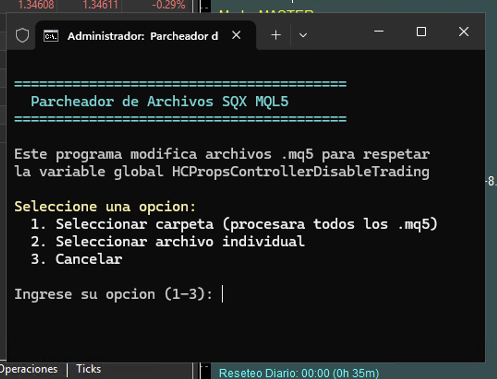
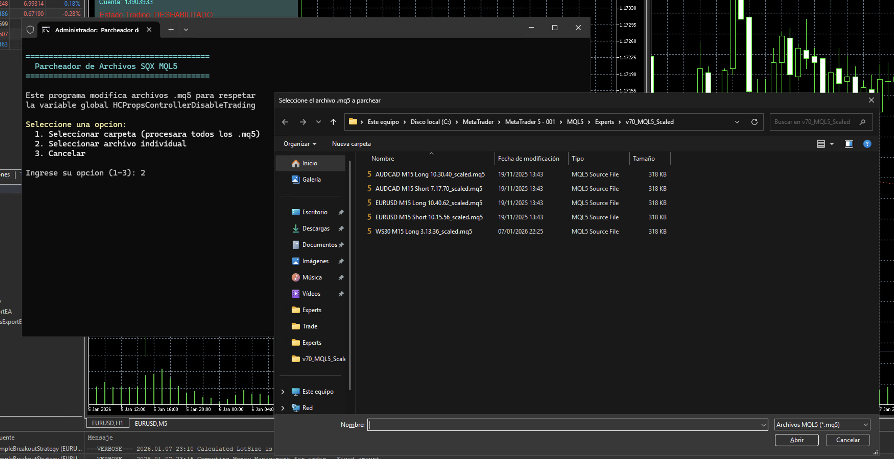
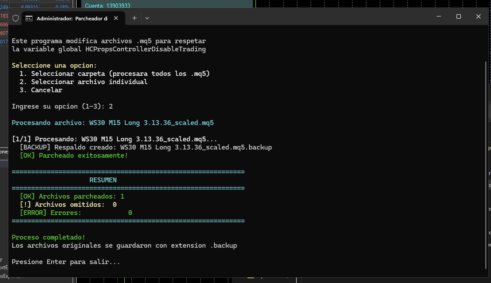
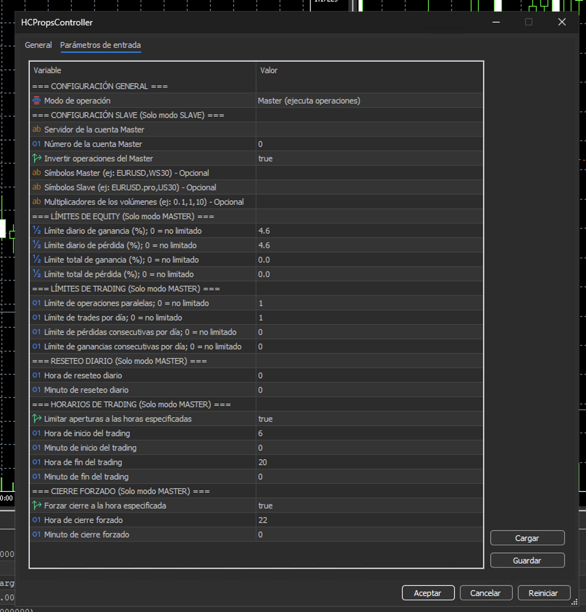
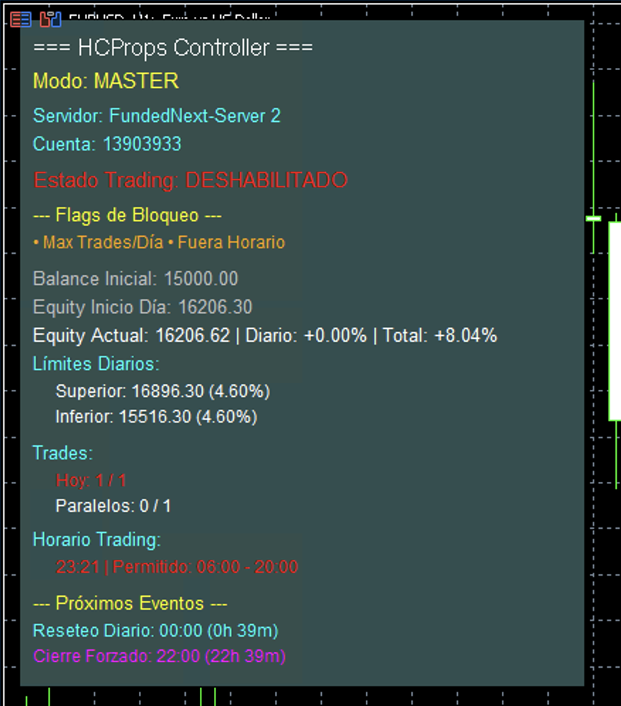

# HCPropsController

Herramienta completa para gestionar y controlar operaciones de trading en cuentas de Prop Trading con MetaTrader 5.

## 📥 Descargar

Ve a la sección [**Releases**](https://github.com/ivanrdgc/HCPropsController/releases) y descarga la última versión. Descomprime el archivo ZIP en tu carpeta de trabajo.

## 🚀 Inicio Rápido

### ¿Qué incluye este proyecto?

1. **HCPropsController.mq5** - Expert Advisor para controlar límites de riesgo y copy trading
2. **Parcheador de StrategyQuant** - Herramienta para modificar EAs exportados desde SQX

---

## 📋 Parchear EAs de StrategyQuant

Si exportas Expert Advisors desde StrategyQuant (SQX), necesitas parchearlos para que respeten los límites del HCPropsController.



### Pasos Sencillos:

1. **Descarga los archivos del parcheador**:
   - `Ejecutar-Parcheador.bat`
   - `Patch-SQX-GV-Disable.ps1`

2. **Coloca ambos archivos en la misma carpeta**

3. **Haz doble clic en `Ejecutar-Parcheador.bat`**



4. **Selecciona una opción**:
   - **Opción 1**: Procesar todos los archivos `.mq5` en una carpeta
   - **Opción 2**: Procesar un archivo individual



5. **Sigue las instrucciones en pantalla**

El programa creará automáticamente un respaldo (`.backup`) de cada archivo antes de modificarlo.

### ¿Qué hace el parcheador?

Modifica tus EAs para que se detengan automáticamente cuando el HCPropsController alcance los límites de riesgo configurados.

---

## 🎮 Usar HCPropsController

### Instalación

1. Copia el archivo `HCPropsController.mq5` a la carpeta `MQL5/Experts/` de tu MetaTrader 5
2. Reinicia MetaTrader 5 o actualiza la lista de Expert Advisors (F5)
3. Arrastra el EA a un gráfico

### Dos Modos de Operación

#### 🔴 Modo MASTER (Cuenta Principal)

El EA controla los límites de riesgo y ejecuta operaciones en esta cuenta.

**Parámetros Principales:**



**=== CONFIGURACIÓN GENERAL ===**
- `Modo de operación` - Selecciona `Master (ejecuta operaciones)` para este modo

**=== LÍMITES DE EQUITY (Solo modo MASTER) ===**
- `Límite diario de ganancia (%); 0 = no limitado` - Límite diario de ganancia. Ejemplo: `4.6` = 4.6%
- `Límite diario de pérdida (%); 0 = no limitado` - Límite diario de pérdida. Ejemplo: `4.6` = 4.6%
- `Límite total de ganancia (%); 0 = no limitado` - Límite total de ganancia. Ejemplo: `8.1` = 8.1%
- `Límite total de pérdida (%); 0 = no limitado` - Límite total de pérdida. Ejemplo: `8.1` = 8.1%
- **Nota**: Pon `0` para deshabilitar cualquier límite

**=== LÍMITES DE TRADING (Solo modo MASTER) ===**
- `Límite de operaciones paralelas; 0 = no limitado` - Máximo de operaciones abiertas al mismo tiempo. Ejemplo: `1` = solo 1 operación
- `Límite de trades por día; 0 = no limitado` - Máximo de trades por día. Ejemplo: `1` = solo 1 trade al día
- `Límite de pérdidas consecutivas por día; 0 = no limitado` - Máximo de pérdidas consecutivas. Ejemplo: `0` = sin límite
- `Límite de ganancias consecutivas por día; 0 = no limitado` - Máximo de ganancias consecutivas. Ejemplo: `0` = sin límite
- **Nota**: Pon `0` para deshabilitar cualquier límite

**=== RESETEO DIARIO (Solo modo MASTER) ===**
- `Hora de reseteo diario` - Hora del reseteo (0-23). Ejemplo: `0` = medianoche
- `Minuto de reseteo diario` - Minuto del reseteo (0-59). Ejemplo: `0` = en punto

**=== HORARIOS DE TRADING (Solo modo MASTER) ===**
- `Limitar aperturas a las horas especificadas` - Activar límite de horarios. `true` = activado, `false` = desactivado
- `Hora de inicio del trading` - Hora de inicio (0-23). Ejemplo: `6` = 6:00 AM
- `Minuto de inicio del trading` - Minuto de inicio (0-59). Ejemplo: `0` = en punto
- `Hora de fin del trading` - Hora de fin (0-23). Ejemplo: `20` = 8:00 PM
- `Minuto de fin del trading` - Minuto de fin (0-59). Ejemplo: `0` = en punto

**=== CIERRE FORZADO (Solo modo MASTER) ===**
- `Forzar cierre a la hora especificada` - Activar cierre forzado. `true` = activado, `false` = desactivado
- `Hora de cierre forzado` - Hora de cierre (0-23). Ejemplo: `22` = 10:00 PM
- `Minuto de cierre forzado` - Minuto de cierre (0-59). Ejemplo: `0` = en punto

**Ejemplo de Configuración Típica:**
```
Modo de operación = Master (ejecuta operaciones)
Límite diario de ganancia (%) = 4.6
Límite diario de pérdida (%) = 4.6
Límite total de ganancia (%) = 8.1
Límite total de pérdida (%) = 8.1
Límite de operaciones paralelas = 1
Límite de trades por día = 1
Hora de reseteo diario = 0
Minuto de reseteo diario = 0
Limitar aperturas a las horas especificadas = true
Hora de inicio del trading = 6
Minuto de inicio del trading = 0
Hora de fin del trading = 20
Minuto de fin del trading = 0
Forzar cierre a la hora especificada = true
Hora de cierre forzado = 22
Minuto de cierre forzado = 0
```

#### 🔵 Modo SLAVE (Cuenta Replicadora)

El EA replica las operaciones de la cuenta MASTER de forma proporcional.

**Parámetros Principales:**

**=== CONFIGURACIÓN GENERAL ===**
- `Modo de operación` - Selecciona `Slave (replica operaciones)` para este modo

**=== CONFIGURACIÓN SLAVE (Solo modo SLAVE) ===**
- `Servidor de la cuenta Master` - Nombre exacto del servidor de la cuenta Master. **IMPORTANTE**: Debe coincidir exactamente, incluyendo espacios, mayúsculas y minúsculas
- `Número de la cuenta Master` - Número de cuenta del Master. Ejemplo: `12345678`
- `Invertir operaciones del Master` - Invertir posiciones del Master. `true` = invertir (BUY→SELL), `false` = copiar igual
- `Símbolos Master (ej: EURUSD,WS30) - Opcional` - Símbolos del Master separados por coma. Ejemplo: `EURUSD,WS30`. Dejar vacío si no se necesita mapeo
- `Símbolos Slave (ej: EURUSD.pro,US30) - Opcional` - Símbolos del Slave correspondientes. Ejemplo: `EURUSD.pro,US30`. Debe tener el mismo número de elementos que los símbolos Master
- `Multiplicadores de los volúmenes (ej: 0.1,1,10) - Opcional` - Multiplicadores de volumen separados por coma. Ejemplo: `0.1,1,10`. Debe tener el mismo número de elementos que los símbolos Master

**Ejemplo de Configuración:**
```
Modo de operación = Slave (replica operaciones)
Servidor de la cuenta Master = "Mi Broker Demo"
Número de la cuenta Master = 12345678
Invertir operaciones del Master = false
Símbolos Master = "EURUSD,WS30"
Símbolos Slave = "EURUSD.pro,US30"
Multiplicadores de los volúmenes = "1,1"
```

**Nota sobre Proporcionalidad:**
- Si el Master tiene balance de $10,000 y abre 0.1 lotes
- Y el Slave tiene balance de $5,000
- El Slave abrirá 0.05 lotes (proporcional al balance)

---

## 📊 Panel de Información

El EA muestra un panel en el gráfico con toda la información importante:



- Estado de trading (HABILITADO/DESHABILITADO)
- Límites configurados y estado actual
- Trades abiertos hoy / máximo permitido
- Horarios de trading
- Próximos eventos (reseteo diario, cierre forzado)
- En modo SLAVE: estado de conexión con el Master

---

## ⚠️ Importante

### Para Usuarios de StrategyQuant:

1. **Primero** parchea tus EAs exportados desde SQX usando el parcheador
2. **Luego** instala y configura el HCPropsController
3. **Finalmente** ejecuta tus EAs parcheados junto con el HCPropsController

### Verificación del Nombre del Servidor (Modo SLAVE):

El nombre del servidor debe coincidir **EXACTAMENTE** con el del Master, incluyendo:
- Mayúsculas y minúsculas
- Espacios
- Caracteres especiales

Para verificar el nombre exacto del servidor:
1. Abre MetaTrader 5
2. Ve a "Herramientas" → "Opciones" → "Servidor"
3. Copia el nombre exacto que aparece allí

---

## ❓ Preguntas Frecuentes

**P: ¿Puedo usar el EA sin parchear mis EAs de SQX?**  
R: Sí, pero tus EAs no se detendrán automáticamente cuando se alcancen los límites.

**P: ¿Qué pasa si alcanzo un límite?**  
R: El EA cerrará todas las posiciones, eliminará órdenes pendientes y deshabilitará el trading hasta el próximo reseteo diario.

**P: ¿Puedo tener múltiples cuentas SLAVE conectadas a un MASTER?**  
R: Sí, puedes tener tantas cuentas SLAVE como quieras conectadas al mismo MASTER.

**P: ¿El Slave replica exactamente el mismo volumen?**  
R: No, replica proporcionalmente según el balance inicial de cada cuenta.

**P: ¿Qué significa "0 = no limitado"?**  
R: Si pones `0` en cualquier límite, ese límite estará deshabilitado y no se aplicará.

---

## 📚 Documentación Técnica

Para información técnica detallada, consulta [**DOCS.md**](DOCS.md).

---

## 🆘 Soporte

Si tienes problemas:
1. Revisa los mensajes en la pestaña "Expertos" de MetaTrader 5
2. Verifica que todos los parámetros estén configurados correctamente
3. Asegúrate de que los archivos estén en las carpetas correctas

---

## 📝 Notas

- El EA funciona solo con MetaTrader 5
- Requiere Windows para usar el parcheador (PowerShell)
- Los límites se calculan automáticamente basándose en el balance inicial de la cuenta
- El panel se actualiza cada segundo con la información más reciente

---

**Versión**: 1.1
**Última actualización**: 20245
