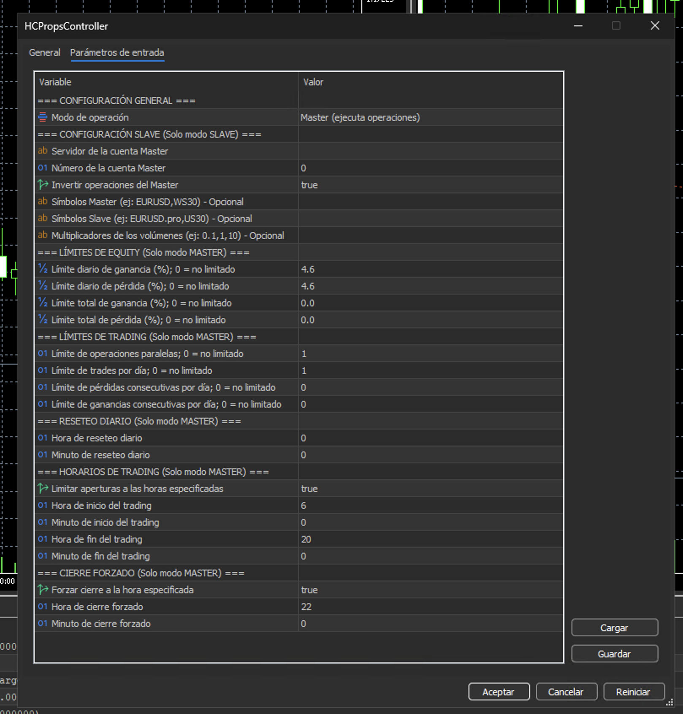
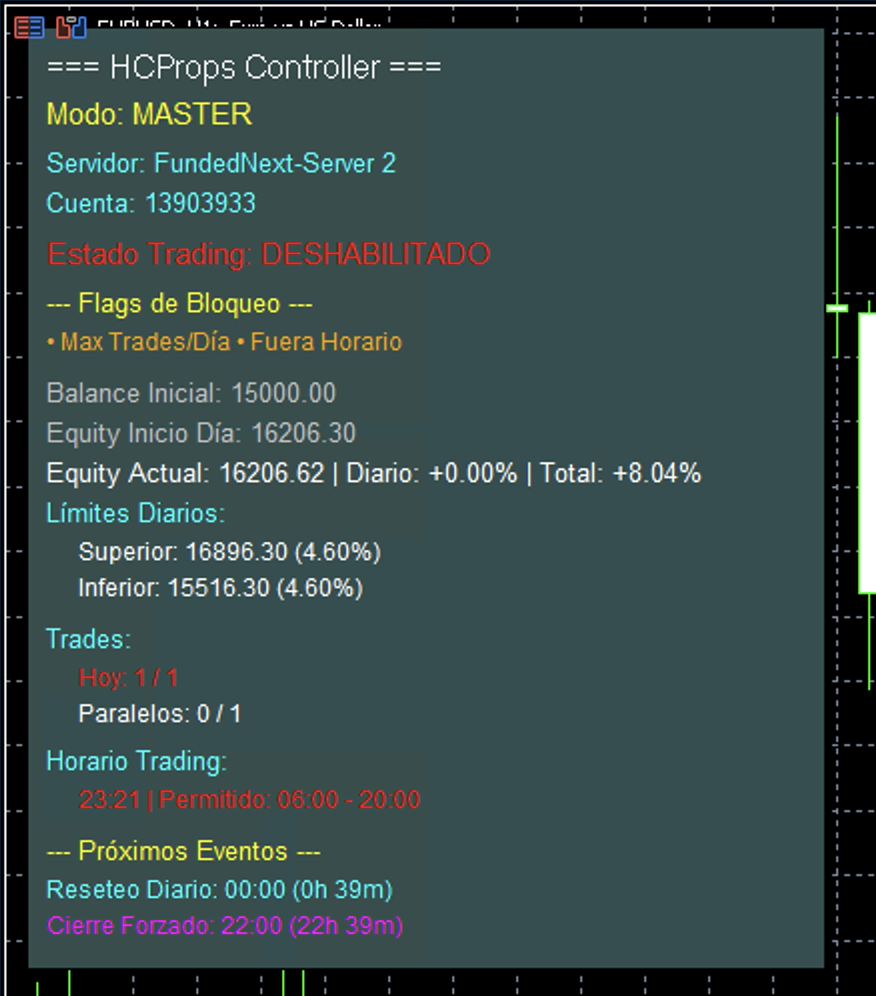
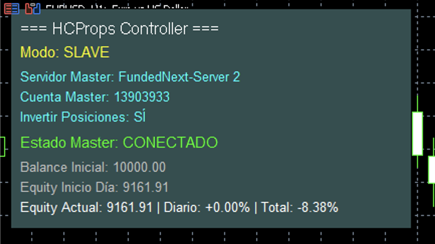
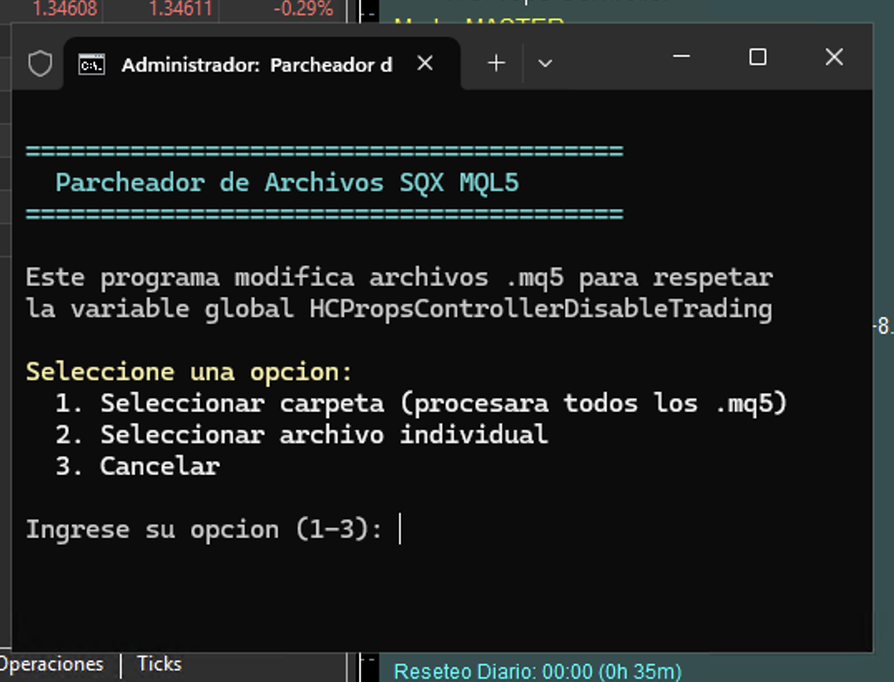
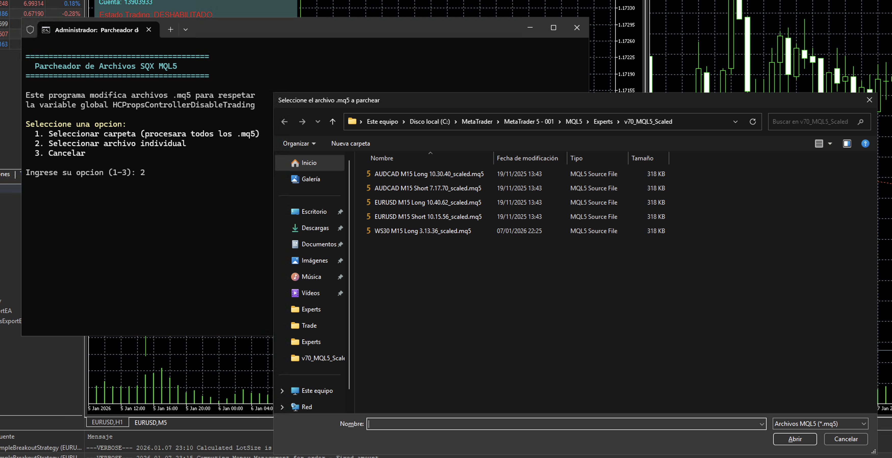
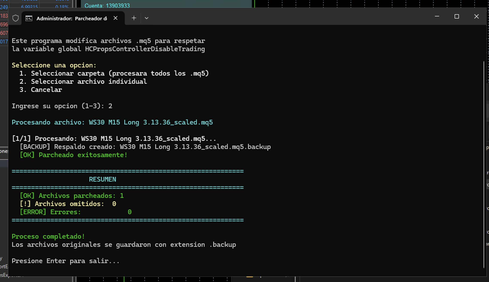

# HCPropsController

A complete toolkit to manage and control trading activity on Prop Trading accounts in MetaTrader 5.

Everything is driven from **one single Expert Advisor**. There is no server, no login, and no license — it works **100% offline** on your own machine/VPS.

---

## Table of Contents

- [What's Included](#whats-included)
- [Features at a Glance](#features-at-a-glance)
- [Download](#download)
- [Quick Start](#quick-start)
- [The HCPropsController EA](#the-hcpropscontroller-ea)
  - [Installation](#installation)
  - [The Two Operating Modes](#the-two-operating-modes)
  - [MASTER Mode Parameters](#master-mode-parameters)
  - [SLAVE Mode Parameters](#slave-mode-parameters)
- [Feature: Prop-Firm Guardian](#feature-prop-firm-guardian)
- [Feature: Copy Trading (Master / Slave)](#feature-copy-trading-master--slave)
- [Feature: News Filter](#feature-news-filter)
- [Feature: Information Panel](#feature-information-panel)
- [Feature: Crash-Safe State Persistence](#feature-crash-safe-state-persistence)
- [Tool: Calendar Checker (CheckCalendar)](#tool-calendar-checker-checkcalendar)
- [Tool: StrategyQuant EA Patcher](#tool-strategyquant-ea-patcher)
- [How Synchronization Works (Technical)](#how-synchronization-works-technical)
- [Frequently Asked Questions](#frequently-asked-questions)
- [Important Notes](#important-notes)
- [Troubleshooting / Support](#troubleshooting--support)

---

## What's Included

| File | Type | Purpose |
|------|------|---------|
| `HCPropsController.mq5` | Expert Advisor | The core EA: Master/Slave copy trading + prop-firm risk guardian + news filter, all in one. |
| `CheckCalendar.mq5` | Script | Verifies that MT5's native economic calendar works on your broker (required for the news filter). |
| `Patch-SQX-GV-Disable.ps1` + `Ejecutar-Parcheador.bat` | Windows tool | Patches EAs exported from StrategyQuant (SQX) so they obey HCPropsController's limits. |
| `patch-gv-disable.py` | Cross-platform tool | Same patcher as above, for Linux / macOS / any system with Python 3. |

> **Everything is controlled from a single EA.** The news filter is built into `HCPropsController` (it is **not** a separate EA). No backend, login, or WebRequest is required for the default configuration.

---

## Features at a Glance

- **Prop-firm risk guardian** — daily and total profit/loss limits, max parallel trades, max trades per day, consecutive win/loss streak limits, trading-hours window, and a forced close time. When a limit is hit it closes positions, deletes pending orders, and disables trading.
- **Copy trading** — replicate one MASTER account onto any number of SLAVE accounts on the same machine, with lot multiplier, symbol mapping, inverse mode, and a copy mode that optionally mirrors SL/TP changes.
- **News filter** — pause or close trading around economic news using MT5's native economic calendar (offline), or a custom CSV feed.
- **Live information panel** — an on-chart dashboard showing status, limits, counters, schedules, and connection state.
- **Crash-safe** — risk state is persisted in MT5 Global Variables and survives EA restarts and VPS reboots.
- **SQX integration** — a patcher that makes StrategyQuant EAs stop trading whenever HCPropsController blocks trading.

---

## Download

Go to the [**Releases**](https://github.com/ivanrdgc/HCPropsController/releases) section and download the latest version. Unzip the archive into your working folder.

> **Note on the compiled `.ex5` files:** if you edit any `.mq5` source, recompile it in MetaEditor (F7) so your changes take effect. The shipped `.ex5` reflects the source as released.

---

## Quick Start

1. Copy `HCPropsController.mq5` into your MT5 `MQL5/Experts/` folder and compile it (or use the provided `.ex5`).
2. Attach the EA to a chart on your **MASTER** account, choose your risk limits, and you're protected.
3. (Optional) Attach the same EA in **SLAVE** mode on other accounts/terminals to copy trades.
4. (Optional, for StrategyQuant users) Patch your SQX EAs so they pause when a limit is hit.
5. (Optional) Turn on the news filter and verify your broker serves the calendar with `CheckCalendar`.

---

## The HCPropsController EA

### Installation

1. Copy `HCPropsController.mq5` into the `MQL5/Experts/` folder of your MetaTrader 5.
2. Restart MetaTrader 5 or refresh the Navigator (F5), then compile the EA in MetaEditor (F7).
3. Drag the EA onto a chart.
4. In **Tools → Options → Expert Advisors**, allow algorithmic trading. (Only needed for the URL news source: add the feed URL under "Allow WebRequest for listed URL".)

### The Two Operating Modes



#### 🔴 MASTER mode (primary account)

The EA executes/monitors trading on this account, enforces the risk limits (when `PropFirmMode` is on), runs the news filter, and writes a shared file describing its open positions so Slaves can copy them.

#### 🔵 SLAVE mode (replicating account)

The EA reads the Master's shared file and replicates its positions. It does not enforce prop-firm limits (it only mirrors the Master), except for its own optional total-profit cutoff.

---

### MASTER Mode Parameters

#### === GENERAL SETTINGS ===

| Parameter | Variable | Default | Description |
|-----------|----------|---------|-------------|
| Operation mode | `Mode` | `Master (executes trades)` | Select MASTER for this account. |
| Enable limits guardian | `PropFirmMode` | `true` | `true` = enforce all risk limits. `false` = the Master only mirrors positions to Slaves (pure relay, no intervention in your trading). |
| Force initial balance | `ForceInitialBalance` | `0` | `0` = auto-detect the initial balance from deposits. `>0` = use this fixed value as the initial balance (basis for total/% limits). |
| Reset counters and locks on init | `ResetCountersOnInit` | `false` | `true` + reinitialize the EA = resets counters, daily initial equity, and **clears the sticky total lock**. Use it when starting a fresh account/challenge. |

#### === SYNC FILE ===

| Parameter | Variable | Default | Description |
|-----------|----------|---------|-------------|
| File name | `FileName` | `""` | Shared file name (empty = auto-generated from server + account number). The Slave must point at the same name. |
| Custom path | `CustomFilePath` | `""` | Custom path inside `Common\Files` (optional). |
| Symbols | `Symbols` | `""` | (MASTER) Comma-separated symbols to replicate (empty = all). E.g. `EURUSD,US30`. |

#### === EQUITY LIMITS (MASTER only) ===

| Parameter | Variable | Default | Description |
|-----------|----------|---------|-------------|
| Daily profit limit (%) | `DailyProfitLimitPercent` | `4.6` | Daily profit cap. `0` = disabled. |
| Daily loss limit (%) | `DailyLossLimitPercent` | `4.6` | Daily loss cap. `0` = disabled. |
| Total profit limit (%) | `TotalProfitLimitPercent` | `8.1` | Total profit cap. `0` = disabled. |
| Total loss limit (%) | `TotalLossLimitPercent` | `8.1` | Total loss cap. `0` = disabled. |

> Set any limit to `0` to disable it. See [Prop-Firm Guardian](#feature-prop-firm-guardian) for how the limits are calculated.

#### === TRADING LIMITS (MASTER only) ===

| Parameter | Variable | Default | Description |
|-----------|----------|---------|-------------|
| Parallel trades limit | `MaxParallelTrades` | `1` | Max positions open at the same time. `0` = no limit. |
| Trades per day limit | `MaxTradesPerDay` | `1` | Max trades opened per day. `0` = no limit. |
| Consecutive losses per day limit | `MaxConsecLossesPerDay` | `0` | Max consecutive losing trades. `0` = no limit. |
| Consecutive wins per day limit | `MaxConsecWinsPerDay` | `0` | Max consecutive winning trades. `0` = no limit. |

#### === DAILY RESET (MASTER only) ===

| Parameter | Variable | Default | Description |
|-----------|----------|---------|-------------|
| Daily reset hour | `DailyResetHour` | `0` | Hour of the daily reset (0–23). `0` = midnight. |
| Daily reset minute | `DailyResetMinute` | `0` | Minute of the daily reset (0–59). |

At the reset time, counters, daily initial equity, and the daily equity lock are reset/recalculated.

#### === TRADING HOURS (MASTER only) ===

| Parameter | Variable | Default | Description |
|-----------|----------|---------|-------------|
| Limit new entries to the specified hours | `LimitTradingHours` | `true` | Enable the trading-hours window. |
| Trading start hour / minute | `TradingStartHour` / `TradingStartMinute` | `6` / `0` | Window start (e.g. 06:00). |
| Trading end hour / minute | `TradingEndHour` / `TradingEndMinute` | `20` / `0` | Window end (e.g. 20:00). Windows that cross midnight are supported. |

Outside the window, new entries are blocked and pending orders are removed; open positions are **not** force-closed by this rule.

#### === FORCED CLOSE (MASTER only) ===

| Parameter | Variable | Default | Description |
|-----------|----------|---------|-------------|
| Force close at the specified time | `ForceExitEnabled` | `true` | Enable a daily forced close. |
| Forced close hour / minute | `TradingExitHour` / `TradingExitMinute` | `22` / `0` | At this time, **all positions are closed** and pending orders deleted. |

#### === NEWS PROTECTION (MASTER only) ===

See the dedicated [News Filter](#feature-news-filter) section for full details.

| Parameter | Variable | Default | Description |
|-----------|----------|---------|-------------|
| News handling mode | `NewsMode` | `OPERATE` | `OPERATE` / `PAUSE_OPEN` / `CLOSE_ALL`. |
| Protection before and after (seconds) | `NewsDuration` | `120` | Half-window in seconds around each event. |
| Currencies to watch | `NewsCurrencies` | `""` | E.g. `EUR,USD,GBP`. Empty = derive from the chart symbol. |
| Minimum impact to consider | `NewsMinImpact` | `HIGH` | `LOW` / `MODERATE` / `HIGH`. |
| Calendar source | `NewsSource` | `MT5` | `MT5` (native calendar) or `URL` (custom CSV feed). |
| CSV feed URL | `NewsCalendarUrl` | `""` | Only for `NewsSource = URL`. |

#### Typical MASTER configuration

```
Operation mode                = Master (executes trades)
Enable limits guardian        = true
Daily profit limit (%)        = 4.6
Daily loss limit (%)          = 4.6
Total profit limit (%)        = 8.1
Total loss limit (%)          = 8.1
Parallel trades limit         = 1
Trades per day limit          = 1
Daily reset hour / minute     = 0 / 0
Limit new entries to hours    = true
Trading start                 = 06:00
Trading end                   = 20:00
Force close at time           = true
Forced close                  = 22:00
```

---

### SLAVE Mode Parameters

#### === GENERAL SETTINGS ===

| Parameter | Variable | Description |
|-----------|----------|-------------|
| Operation mode | `Mode` | Select `Slave (replicates trades)`. |

#### === SLAVE SETTINGS (SLAVE only) ===

| Parameter | Variable | Default | Description |
|-----------|----------|---------|-------------|
| Master account server | `MasterServer` | `""` | Exact server name of the Master (only if `FileName` is empty). **Must match EXACTLY**, including spaces and case. |
| Master account number | `MasterAccountNumber` | `0` | Master account number (only if `FileName` is empty). |
| Symbol mapping | `SymbolMapping` | `""` | Format `MASTER:SLAVE;MASTER2:SLAVE2`. E.g. `EURUSD:EURUSD.pro;US30:US30Cash`. Empty = same names. |
| Copy mode | `CopyMode` | `NORMAL` | `NORMAL` also replicates SL/TP modifications; `INCOGNITO` sets SL/TP only at open and ignores later changes. |
| Invert Master trades (and SL/TP) | `InverseMode` | `false` | `true` = trade the opposite direction (BUY→SELL) and swap SL/TP. |
| Lot multiplier | `RiskMultiplier` | `1.0` | Slave lot = Master lot × multiplier. `1.0` = same, `0.5` = half, `2.0` = double. |
| Allowed slippage (points) | `Slippage` | `10` | Permitted deviation in points. |
| Magic Number | `MagicNumber` | `987654` | Magic of the Slave's orders. Must be unique per Slave within the **same** terminal. The EA only manages positions carrying this magic. |
| Slave total profit limit (%) | `SlaveTotalProfitLimitPercent` | `0.0` | `0` = no limit. When reached, the Slave closes everything and stops replicating. |

#### Example SLAVE configuration

```
Operation mode        = Slave (replicates trades)
Master account server = "My Broker Demo"
Master account number = 12345678
Symbol mapping        = "EURUSD:EURUSD.pro;US30:US30Cash"
Copy mode             = NORMAL
Invert Master trades  = false
Lot multiplier        = 1.0
Allowed slippage      = 10
Magic Number          = 987654
```

> **Tip:** You can point a Slave at the Master purely by `FileName` (both sides use the same name). In that case you do not need to fill in `MasterServer` / `MasterAccountNumber`.

---

## Feature: Prop-Firm Guardian

Active in **MASTER** mode when `PropFirmMode = true`. The guardian continuously monitors the account and enforces every configured limit.

### What each limit does when breached

| Limit | Action when hit | Re-enables when |
|-------|-----------------|-----------------|
| **Total** profit/loss (equity) | Closes all positions + deletes pending orders + disables trading. **Sticky** — stays locked even if equity recovers. | Only by setting `ResetCountersOnInit = true` and reinitializing. |
| **Daily** profit/loss (equity) | Closes all positions + deletes pending orders + disables trading. **Sticky** for the rest of the day. | At the next daily reset. |
| Max trades per day | Blocks new entries + deletes pending orders. Open positions are kept. | At the next daily reset. |
| Max parallel trades | Blocks new entries + deletes pending orders. If the open count **exceeds** the limit, closes the **newest** position(s) down to the limit (a position count merely *equal* to the limit is kept, to avoid open/close churn). | When position count drops below the limit. |
| Consecutive wins / losses | Closes all positions + deletes pending orders + disables trading. | At the next daily reset. |
| Outside trading hours | Blocks new entries + deletes pending orders. | Inside the trading window. |
| Forced close time | Closes all positions + deletes pending orders. | — (one-shot at the configured time). |

"Disabling trading" sets the MT5 Global Variable `HCPropsControllerDisableTrading` to `1.0`. Any EA that checks this variable — such as SQX EAs processed by the [patcher](#tool-strategyquant-ea-patcher) — will stop opening new positions while it is set.

### How the limits are calculated

- **Initial balance** (`AccountDepositsAndWithdrawals`) = sum of deposits/withdrawals/credits/charges detected from account history (or `ForceInitialBalance` if you set it). This is the basis for percentage limits.
- **Daily initial equity** = account equity at the daily reset time.

**Total limits** (percent of initial balance):

```
Total upper = InitialBalance × (1 + TotalProfitLimitPercent / 100)
Total lower = InitialBalance × (1 − TotalLossLimitPercent  / 100)
```

**Daily limits** use the more conservative of daily equity vs. initial balance as the basis (`basis = min(DailyInitialEquity, InitialBalance)`):

```
Daily upper = DailyInitialEquity + basis × DailyProfitLimitPercent / 100
Daily lower = DailyInitialEquity − basis × DailyLossLimitPercent  / 100
```

Using the smaller basis prevents the daily allowance from drifting larger than your account can support after a gain.

---

## Feature: Copy Trading (Master / Slave)

One MASTER account broadcasts its open positions to any number of SLAVE accounts running on the **same machine/VPS** (communication is via a shared file — see [How Synchronization Works](#how-synchronization-works-technical)).

- **Per-ticket mapping.** Each Master position is mapped to a Slave position via the order comment `HC<masterTicket>` plus the Slave's `MagicNumber`. The Slave only ever manages positions carrying its own magic.
- **Lot sizing.** `SlaveLot = NormalizeVolume(MasterLot × RiskMultiplier)`, clamped to the symbol's min/max/step. It is **not** proportional to balance — use `RiskMultiplier` to scale between accounts of different sizes.
- **SL/TP replication.** `CopyMode = NORMAL` mirrors later SL/TP modifications; `INCOGNITO` fixes SL/TP only at open.
- **Inverse trading.** `InverseMode = true` flips BUY↔SELL and swaps SL/TP.
- **Symbol mapping.** Use `SymbolMapping` (`MAST:SLAV;MAST2:SLAV2`) when broker symbol names differ.
- **Volume reduction tracking.** If the Master partially closes a position, the Slave reduces its volume to match (reduction only).
- **Per-Slave profit cutoff.** `SlaveTotalProfitLimitPercent` closes everything and stops the Slave once reached.

> **Account type:** designed for **hedging** accounts (and the common case of one position per symbol per account).
>
> **News interaction:** the news filter runs on the MASTER. When the Master pauses or closes due to news, the Slaves replicate that automatically on the next sync.

---

## Feature: News Filter

Built into MASTER mode. The EA can pause or close trading around economic news using MetaTrader 5's **native economic calendar** — no email, API, or WebRequest required. It reads the calendar that MetaQuotes already delivers to the terminal.

### Modes (`NewsMode`)

- `OPERATE` — do nothing (filter off).
- `PAUSE_OPEN` *(recommended)* — block **new** entries and cancel pending orders; **keep** open positions.
- `CLOSE_ALL` — close ALL positions + cancel pending orders + block new entries.

### Other parameters

- `NewsDuration` — seconds of protection **before and after** each event. E.g. `120` → protection from 2 min before to 2 min after (a 4-minute window).
- `NewsCurrencies` — uppercase, no spaces: `EUR,USD,GBP`. If left **empty**, the EA uses the base + profit currency of the chart symbol.
- `NewsMinImpact` — `LOW` / `MODERATE` / `HIGH` (default **HIGH**, high-impact events only).
- `NewsSource` — `MT5` (native calendar, recommended) or `URL` (custom feed).
- `NewsCalendarUrl` — only for `NewsSource = URL`: a CSV with lines `epoch,CURRENCY,impact` (1=Low, 2=Moderate, 3=High).

### How it works

1. The EA queries the calendar on start and refreshes it **once per hour**.
2. It filters events by the chosen currencies and minimum impact.
3. When the clock enters the window `[event − NewsDuration, event + NewsDuration]`, it applies the `NewsMode` action.
4. On leaving the window, it re-enables trading automatically.

The panel shows `NEWS ACTIVE: ...` in red during protection, and `News: watching (N)` the rest of the time.

For the **URL** source, add the feed URL under **Tools → Options → Expert Advisors → Allow WebRequest for listed URL**.

---

## Feature: Information Panel

The EA draws an on-chart dashboard with everything important. It only redraws the labels that changed, to avoid flicker.

**MASTER mode:**



**SLAVE mode:**



**MASTER panel shows:** mode (guardian on / sync only), server & account, trading status (ENABLED/DISABLED), active locks, initial balance, day-start equity, live equity with daily/total %, configured daily/total limits with color bands, trades today / parallel / win & loss streaks vs. their caps, the trading-hours window, news status, the next daily reset, and the forced-close time.

**SLAVE panel shows:** mode, the Master it follows, Master account, invert/multiplier/copy-mode summary, connection status (CONNECTED / WAITING FOR MASTER), profit-lock state, and live equity.

**Color coding (graded by how close you are to a limit):**

| Color | Meaning |
|-------|---------|
| 🟢 Green | OK — below 50% of the limit |
| 🟡 Yellow | Caution — 50–75% of the limit |
| 🟠 Orange | Danger — 75–100% of the limit |
| 🔴 Red | Limit reached / trading blocked |

Connection and status labels also use green for the good state (trading enabled, Master connected, inside trading hours) and red/orange for the bad state.

---

## Feature: Crash-Safe State Persistence

When `PropFirmMode = true`, the guardian persists its state in MT5 Global Variables so it survives EA reinitialization, terminal restarts, and VPS reboots:

| Global Variable | Holds |
|-----------------|-------|
| `HCPropsController_InitBalance` | Detected initial balance |
| `HCPropsController_InitEquityDaily` | Day-start equity |
| `HCPropsController_NextReset` | Next daily reset timestamp |
| `HCPropsController_TotalLocked` | Sticky total-lock flag |
| `HCPropsController_DailyLocked` | Daily equity-lock flag |
| `HCPropsControllerDisableTrading` | Shared "stop trading" signal (read by patched SQX EAs) |

On startup the EA restores these values. If a daily reset time was missed while the EA was off, it performs the reset immediately. Set `ResetCountersOnInit = true` to wipe this state and start fresh.

---

## Tool: Calendar Checker (CheckCalendar)

The economic calendar is delivered by **MetaQuotes**, not your broker, but some brokers/builds restrict access to it from MQL5. Use `CheckCalendar.mq5` (a Script) to confirm the news filter will work before relying on it.

### Verify in three steps

1. **Interface:** In MT5, **View → Toolbox → Calendar**. If you see events listed, the terminal has calendar data.
2. **Script:** Compile and run `CheckCalendar.mq5` (drag it onto a chart). It prints, in the *Experts* tab, how many high-impact events exist over the next days. If it prints `>>> OK ...`, the EA can read news on this broker.
3. **EA log:** On start (with `NewsMode` other than `OPERATE`), the EA prints `NEWS: N news scheduled`. If this is always `0` on days with obvious news (NFP, CPI, FOMC), the broker is not serving the calendar.

`CheckCalendar` inputs: `InpCurrencies` (currencies to check, empty = all), `InpDaysAhead` (days ahead to list), `InpMinImpact` (1=Low, 2=Moderate, 3=High).

**Requirement:** the terminal must be **connected** to a trading server (the calendar syncs from there). In the Strategy Tester the calendar may be limited on older builds.

**If your broker doesn't serve the calendar:** use `NewsSource = URL` and point `NewsCalendarUrl` at a CSV in the format `epoch,CURRENCY,impact`, then whitelist the URL under **Tools → Options → Expert Advisors → Allow WebRequest**.

---

## Tool: StrategyQuant EA Patcher

If you export Expert Advisors from StrategyQuant (SQX), patch them so they obey HCPropsController's limits. The patcher injects, at the very start of `sqHandleTradingOptions()`, this check:

```mql5
// Check global variable to disable trading
if(GlobalVariableGet("HCPropsControllerDisableTrading") == 1.0) return false;
```

While HCPropsController holds that Global Variable at `1.0` (because a risk limit was hit or a news window is active), the patched EA will not open new positions — instead of immediately re-opening what HCPropsController just closed.

A `.backup` copy of each file is created before it is modified. The patcher is **idempotent**: files that are already patched, or that have no `sqHandleTradingOptions()`, are left unchanged. After patching, **recompile** the resulting `.mq5` in MetaEditor and use those instead of the originals.

### 🪟 Windows (PowerShell)



1. Keep `Ejecutar-Parcheador.bat` and `Patch-SQX-GV-Disable.ps1` **in the same folder**.
2. Double-click **`Ejecutar-Parcheador.bat`**.



3. Choose an option:
   - **Option 1** — process all `.mq5` files in a folder (recursive).
   - **Option 2** — process a single file.
4. Follow the on-screen instructions.



**Other ways to run it (Windows):**

- **Drag & drop** a `.mq5` file or a folder onto `Patch-SQX-GV-Disable.ps1`.
- **From PowerShell:**
  ```powershell
  .\Patch-SQX-GV-Disable.ps1 -Path "C:\Path\To\Your\Folder"
  .\Patch-SQX-GV-Disable.ps1 -Path "C:\Path\To\Your\File.mq5"
  ```

When it finishes you get a summary of **patched**, **skipped** (already patched / no SQX function), and **errors**.

### 🐧 Linux / macOS (Python, no Windows needed)

`patch-gv-disable.py` injects exactly the same line of code as the Windows patcher. It needs only Python 3 (no external dependencies), and the result is identical — use whichever you prefer.

```bash
# Option A — IN-PLACE: patch one file or every .mq5 in a folder (recursive).
#            A .backup copy is made before each file is modified.
python3 patch-gv-disable.py /path/to/MQL5/Experts
python3 patch-gv-disable.py /path/to/MyEA.mq5

# Option B — MIRROR: copy SRC into DST, patching along the way.
#            Originals in SRC are never touched; DST becomes a full mirror.
python3 patch-gv-disable.py /path/to/MQL5 /path/to/MQL5_Patched
```

The exit code is `1` if any file errored, `0` otherwise.

### Recommended order for SQX users

1. **First** patch your SQX-exported EAs with the patcher.
2. **Then** install and configure HCPropsController.
3. **Finally** run your patched EAs alongside HCPropsController.

---

## How Synchronization Works (Technical)

- **Transport:** a CSV file in `Common\Files\HCPropsController\` on the same machine. The name comes from `FileName` / `CustomFilePath`, or is auto-generated as `<base64(server_account)>.csv`. Using the auto name lets multiple Masters coexist on one machine without clashing.
- **CSV format** — one line per Master ticket, 8 comma-separated fields:
  ```
  ticket,symbol,type,volume,openPrice,sl,tp,openTime
  ```
  where `type`: `0` = BUY, `1` = SELL; `volume` = the Master's real lots; `sl`/`tp` = prices.
- **Master writes** only when something changes (a content hash covering ticket, symbol, type, volume, SL, TP is compared each tick, and on every trade transaction). It also force-syncs immediately when a position opens or changes.
- **Slave reads** only when the file's modification time changed since its last read, then reconciles its positions against the file:
  - closes Slave positions the Master no longer has,
  - reopens a position whose direction changed,
  - reduces volume to match a Master partial close,
  - replicates SL/TP in `NORMAL` mode,
  - opens any Master position it does not have yet (tagged with `HC<masterTicket>`).
- **Disconnect detection:** the Master deletes its sync file on shutdown; the Slave then shows `WAITING FOR MASTER`.

---

## Frequently Asked Questions

**Q: Can I use the EA without patching my SQX EAs?**
A: Yes, but your EAs won't stop automatically when a limit is reached — only HCPropsController's own actions (closing positions, deleting pendings) apply.

**Q: What happens when I hit a limit?**
A: For equity limits and forced close, the EA closes all positions, deletes pending orders, and disables trading until the appropriate reset (daily, or `ResetCountersOnInit` for the sticky total lock). For count/streak/hours limits, it blocks new entries and removes pending orders but keeps open positions.

**Q: Can I connect multiple SLAVE accounts to one MASTER?**
A: Yes — as many Slaves as you want, all reading the same Master file. Give each Slave a unique `MagicNumber` within the same terminal.

**Q: Does the Slave copy the exact same volume?**
A: It copies the Master lot × `RiskMultiplier` (1.0 = same), normalized to the Slave symbol's lot step. Adjust the multiplier for accounts of different sizes.

**Q: Does the news filter work without internet / a server?**
A: It uses MT5's native calendar (no backend or login). Confirm your broker serves it with `CheckCalendar.mq5`. If not, fall back to `NewsSource = URL`.

**Q: What does "0 = no limit" mean?**
A: Setting `0` on any limit disables that limit entirely.

**Q: How do I find my exact server name for SLAVE mode?**
A: In MT5, **Tools → Options → Server**, and copy the name exactly — it must match the Master's character-for-character (case and spaces included). Or just use `FileName` on both sides to avoid the issue.

---

## Important Notes

- Works with **MetaTrader 5** only.
- The Windows patcher requires PowerShell; on Linux/macOS use the Python patcher.
- Risk limits are computed from the account's detected initial balance (or `ForceInitialBalance`).
- The panel updates every second with the latest information.
- Copy trading requires the Master and Slave terminals to share the same `Common\Files` (i.e. run on the same machine/VPS).
- After editing any `.mq5`, recompile it in MetaEditor (F7).

---

## Troubleshooting / Support

If you run into issues:

1. Check the **Experts** and **Journal** tabs in MetaTrader 5 for messages.
2. Verify all parameters are set correctly (especially the Master/Slave linking — `FileName`, or server + account number).
3. Make sure files are in the correct folders and the EAs are compiled.
4. For news, run `CheckCalendar.mq5` to confirm the calendar is available.

---

**Version:** 2.0
